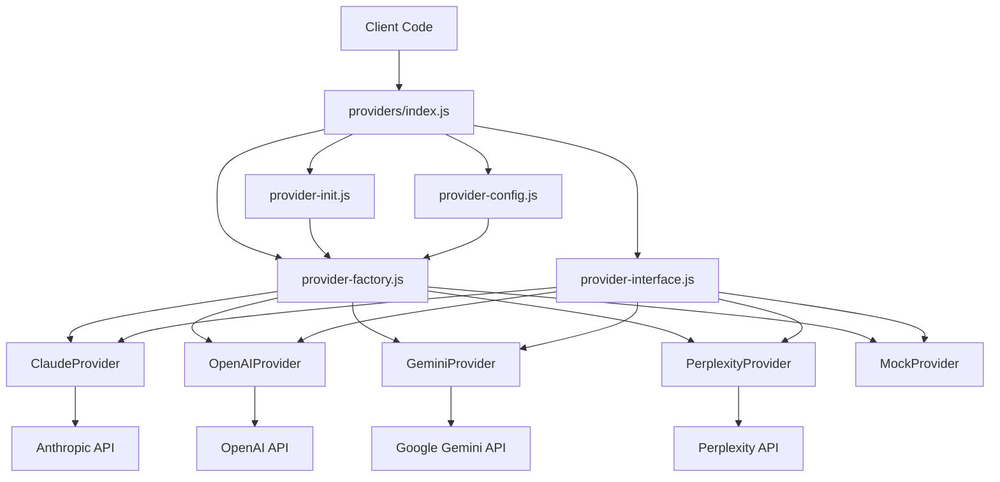
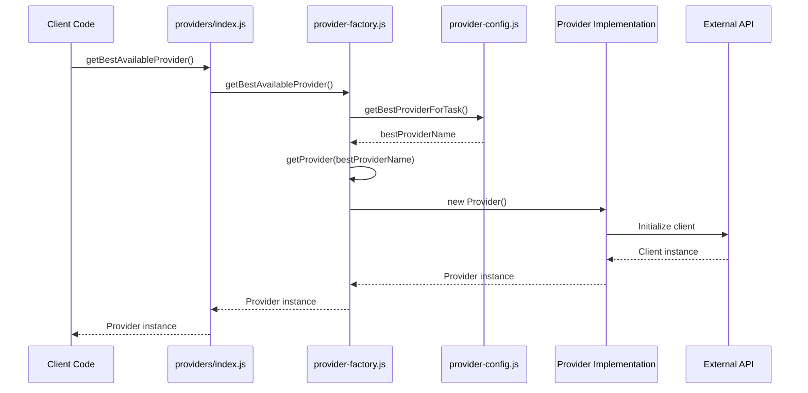
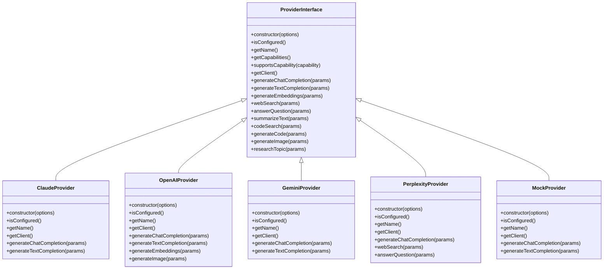

# Provider System Architecture

This document provides a visual representation of the provider system architecture.

## Provider System Overview

## Provider Factory Flow

## Provider Interface Hierarchy

## Provider Configuration Structure

```mermaid
graph TD
    A[providerConfig] --> B[anthropic]
    A --> C[openai]
    A --> D[gemini]
    A --> E[perplexity]
    A --> F[tavily]
    A --> G[exa]
    A --> H[defaultProvider]
    A --> I[research]

    B --> B1[apiKey]
    B --> B2[defaultModel]
    B --> B3[fallbackModel]
    B --> B4[maxTokens]
    B --> B5[temperature]

    C --> C1[apiKey]
    C --> C2[defaultModel]
    C --> C3[fallbackModel]
    C --> C4[maxTokens]
    C --> C5[temperature]

    D --> D1[apiKey]
    D --> D2[defaultModel]
    D --> D3[fallbackModel]
    D --> D4[maxTokens]
    D --> D5[temperature]

    E --> E1[apiKey]
    E --> E2[defaultModel]
    E --> E3[fallbackModel]
    E --> E4[maxTokens]
    E --> E5[temperature]

    F --> F1[apiKey]
    F --> F2[maxResults]

    G --> G1[apiKey]
    G --> G2[maxResults]

    I --> I1[depth]
    I --> I2[maxResults]
    I --> I3[minConfidenceScore]
    I --> I4[defaultTimeout]
```

