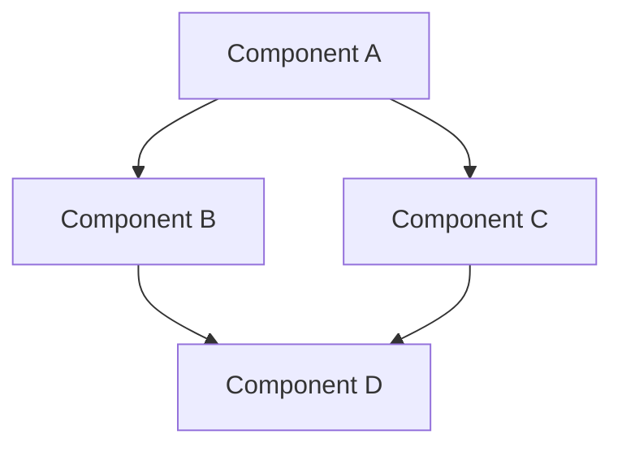
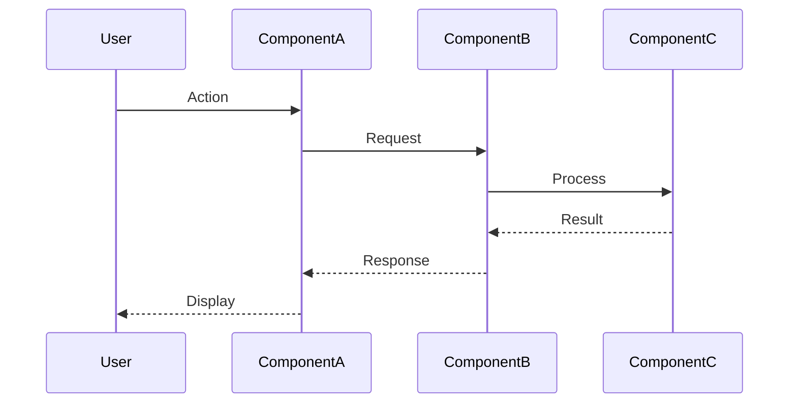

# [Task Name] Architecture Analysis

## Overview

[Brief description of the architecture analysis focus and goals]

## Current Architecture

### Component Overview

[High-level description of the current architecture related to this task]

### Component Diagram

### Key Components

#### Component A

- **Purpose**: [Brief description of purpose]
- **Location**: [File path]
- **Dependencies**: [List of dependencies]
- **Interfaces**: [List of interfaces]
- **Current Limitations**: [List of limitations]

#### Component B

- **Purpose**: [Brief description of purpose]
- **Location**: [File path]
- **Dependencies**: [List of dependencies]
- **Interfaces**: [List of interfaces]
- **Current Limitations**: [List of limitations]

## Integration Points

### Integration Point 1: [e.g., Blueprint Generation]

[Description of how the current system integrates with this component]

### Integration Point 2: [e.g., Research System]

[Description of how the current system integrates with this component]

## Data Flow

[Description of how data flows through the system]

## Identified Issues

### Issue 1: [Brief description]

[Detailed explanation of the issue]

### Issue 2: [Brief description]

[Detailed explanation of the issue]

## Opportunities for Improvement

### Opportunity 1: [Brief description]

[Detailed explanation of the opportunity]

### Opportunity 2: [Brief description]

[Detailed explanation of the opportunity]

## Next Steps

1. [Next step 1, e.g., Evaluate implementation options]
2. [Next step 2, e.g., Create detailed implementation plan]
