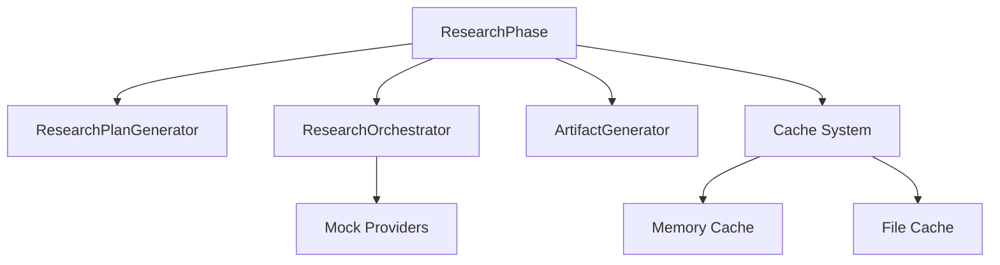
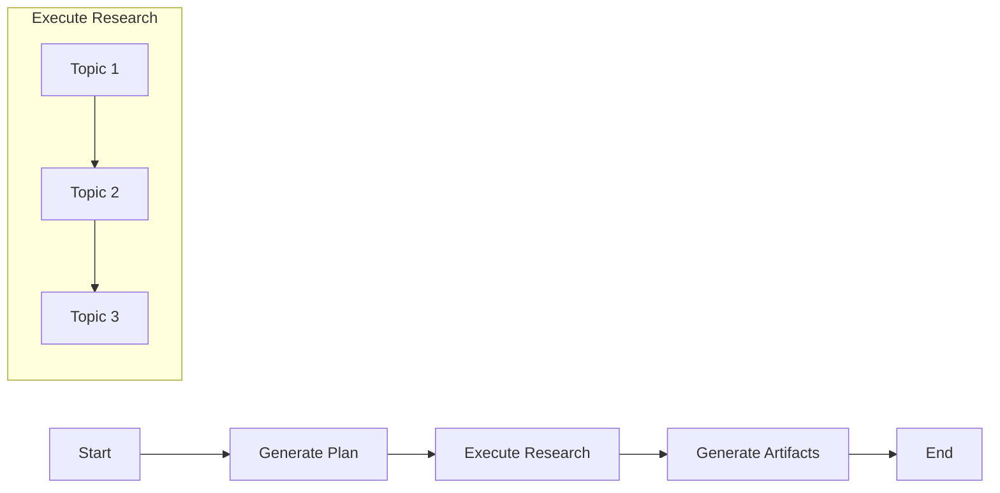
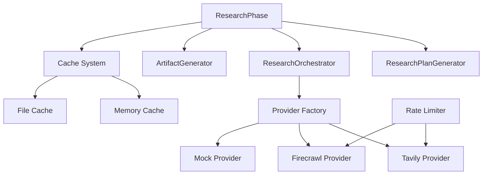
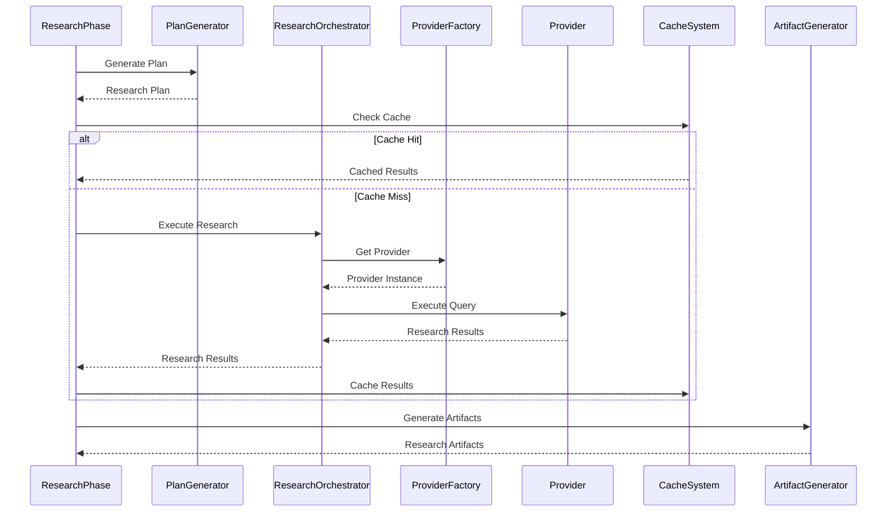

# Research Phase System: Architecture Document

## Overview

This document outlines the architecture of the Research Phase System, focusing on the integration with real research providers like Tavily and Firecrawl. It provides a detailed analysis of the current implementation, component relationships, and proposed architectural changes.

## Current Architecture

The current Research Phase System follows a modular architecture with the following key components:

### Core Components

1. **ResearchPhase**

   - **Purpose**: Coordinates the overall research process
   - **Responsibilities**:
     - Initializing research components
     - Managing research state
     - Coordinating between plan generation, execution, and artifact generation
   - **Dependencies**: ResearchPlanGenerator, ResearchOrchestrator, ArtifactGenerator
   - **File**: `src/research/phase/research-phase.js`

2. **ResearchPlanGenerator**

   - **Purpose**: Generates structured research plans
   - **Responsibilities**:
     - Analyzing research topics
     - Breaking down topics into questions
     - Prioritizing research areas
   - **Dependencies**: None
   - **File**: `src/research/phase/research-plan-generator.js`

3. **ResearchOrchestrator**

   - **Purpose**: Orchestrates research execution
   - **Responsibilities**:
     - Executing research plans
     - Coordinating between providers
     - Aggregating research results
   - **Dependencies**: Mock Providers
   - **File**: `src/research/phase/research-orchestrator.js`

4. **ArtifactGenerator**

   - **Purpose**: Generates research artifacts
   - **Responsibilities**:
     - Creating research summaries
     - Generating architecture diagrams
     - Producing decision documents
     - Creating implementation plans
   - **Dependencies**: None
   - **File**: `src/research/phase/artifact-generator.js`

5. **Cache System**
   - **Purpose**: Caches research results
   - **Responsibilities**:
     - Storing research results
     - Retrieving cached results
     - Managing cache lifecycle
   - **Dependencies**: Memory Cache, File Cache
   - **Files**:
     - `src/research/phase/cache/research-cache.js`
     - `src/research/phase/cache/cache-strategy.js`
     - `src/research/phase/cache/memory-cache.js`
     - `src/research/phase/cache/file-cache.js`

### Flow-Based Architecture

The Research Phase System uses a flow-based architecture for research execution:

This flow-based approach allows for:

- Clear visualization of the research process
- Flexible execution of research tasks
- Potential for parallel execution of independent tasks

### Integration Points

The Research Phase System integrates with other components through:

1. **Blueprint Generation**

   - Research results feed into blueprint generation
   - Integration point: `src/blueprint/research-integrated-blueprint-generator.js`

2. **Task Hierarchy**

   - Research informs task breakdown and sequencing
   - Integration point: `src/utils/task-hierarchy-manager.js`

3. **Confidence Scoring**

   - Research results are scored for confidence
   - Integration point: `src/research/validation/confidence-scorer.js`

4. **Knowledge Extraction**
   - Research is processed to extract knowledge
   - Integration point: `src/research/extraction/knowledge-extractor.js`

## Proposed Architecture

The proposed architecture enhances the current system with real provider integration:

### New Components

1. **Provider Interface**

   - **Purpose**: Defines the contract for all providers
   - **Responsibilities**:
     - Defining provider capabilities
     - Standardizing provider methods
   - **File**: `src/research/phase/providers/research-provider.js`

2. **Provider Factory**

   - **Purpose**: Creates provider instances
   - **Responsibilities**:
     - Instantiating appropriate providers
     - Managing provider configuration
   - **Dependencies**: Provider implementations
   - **File**: `src/research/phase/providers/provider-factory.js`

3. **Tavily Provider**

   - **Purpose**: Integrates with Tavily API
   - **Responsibilities**:
     - Executing Tavily-specific requests
     - Handling Tavily-specific errors
   - **Dependencies**: Provider Interface
   - **File**: `src/research/phase/providers/tavily-provider.js`

4. **Firecrawl Provider**

   - **Purpose**: Integrates with Firecrawl API
   - **Responsibilities**:
     - Executing Firecrawl-specific requests
     - Handling Firecrawl-specific errors
   - **Dependencies**: Provider Interface
   - **File**: `src/research/phase/providers/firecrawl-provider.js`

5. **Rate Limiter**
   - **Purpose**: Manages API call rates
   - **Responsibilities**:
     - Limiting API call frequency
     - Implementing backoff strategies
   - **File**: `src/research/phase/rate-limiting/rate-limiter.js`

### Component Relationships

The key relationships in the proposed architecture are:

1. **ResearchOrchestrator to Provider Factory**

   - ResearchOrchestrator uses Provider Factory to create provider instances
   - Provider Factory returns the appropriate provider based on configuration

2. **Provider Factory to Provider Implementations**

   - Provider Factory instantiates concrete provider implementations
   - All providers implement the Provider Interface

3. **Rate Limiter to Providers**

   - Rate Limiter manages API call rates for providers
   - Providers use Rate Limiter to avoid API throttling

4. **Cache System to ResearchPhase**
   - Cache System stores and retrieves research results
   - ResearchPhase uses Cache System to avoid redundant API calls

## Data Flow

The data flow in the proposed architecture is as follows:

## Performance Considerations

The proposed architecture addresses performance through:

1. **Caching**

   - In-memory caching for frequent access
   - File-based caching for persistence
   - Intelligent cache invalidation

2. **Asynchronous Execution**

   - Non-blocking API calls
   - Parallel execution where possible
   - Progress reporting for long-running operations

3. **Rate Limiting**

   - Preventing API throttling
   - Implementing exponential backoff
   - Intelligent provider selection

4. **Resource Management**
   - Efficient memory usage
   - Proper cleanup of resources
   - Streaming for large responses

## Error Handling

The proposed architecture implements robust error handling:

1. **Provider-Specific Errors**

   - Each provider handles its specific error patterns
   - Standardized error reporting to higher levels

2. **Retry Mechanisms**

   - Automatic retries for transient errors
   - Exponential backoff for rate limiting

3. **Fallback Mechanisms**

   - Falling back to alternative providers when primary providers fail
   - Graceful degradation of functionality

4. **Error Reporting**
   - Detailed error logging
   - User-friendly error messages
   - Diagnostic information for troubleshooting

## Conclusion

The proposed architecture enhances the current Research Phase System with:

1. **Real Provider Integration**: Adding Tavily and Firecrawl providers
2. **Provider Abstraction**: Using adapter and factory patterns
3. **Performance Optimization**: Through caching and asynchronous execution
4. **Robust Error Handling**: For provider-specific errors
5. **Rate Limiting**: To avoid API throttling

This architecture provides a flexible, maintainable, and efficient foundation for integrating with real research providers while maintaining compatibility with the existing system.
